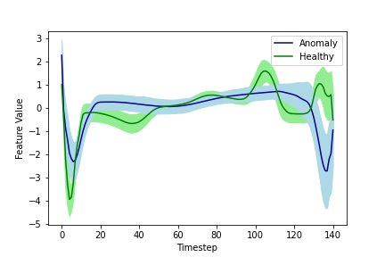
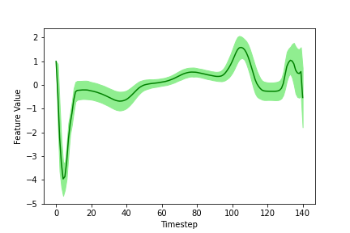
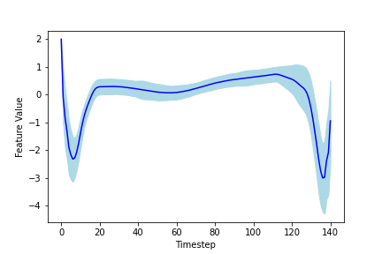
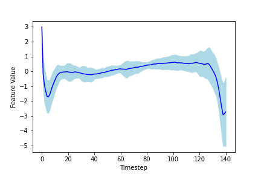
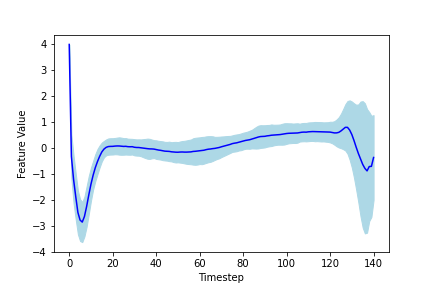
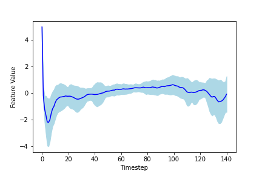

# Anomaly-Detection & Classification of Time-Series Data
## Using FC, LSTM and CNN1D Autoencoder Neural Networks
This is my latest project in which I want to analyze and detect anomalies in univariate time series data with autoencoder neural networks.
## The Data 
The used dataset is the ECG5000, which contains biosignals from humans. The data is a collection from an electrocardiogram.

 

In the left picture you can see the average of the timeseries samples with one standard deviation of the healthy signals in green and the average of the anomaly samples of the signals in blue. In the right plot, you can see the distribution of the dataset - we have a large amount of healthy timeseries sequences (label 1) and a large amount of anomalies (label 2, 3, 4 and 5). The labels 2, 3, 4, 5 are different conditions, but they are all anomaly sequences.

The healthy and normal sequence of the whole dataset is seen in the following plot, averaged over all healthy sequences:

All the sequences, that are classified as the anomalies are presented below, each averaged over all sequences of the same label:
    

## Goals
I want to implement:
- Unsupervised/ Semi Supervised Learning
- Classification

of time series data using an Autoencoder (AE) and Variational Autoencoder (VAE) Neural Networks.
I will test
- Fully Connected (FC)
- Long-Short-Term-Memory (LSTM)
- 1D Convolutional (CNN1D)

Neural Networks based on their performance on different metrics like Accuracy, Precision and Recall.

## Autoencoder (AE)
Autoencoder Neural Networks, in general, crunches the high-dimensional data into  a compressed, low-dimensional representation of the data and then classifies anomalys based on the reconstruction-error of trying to reconstruct the original data from the compressed and low-dimensional data representation. Autoencoders are therefore a more general and nonlinear form of the linear Principal Component Analysis (PCA).

Image Source: https://lilianweng.github.io/lil-log/2018/08/12/from-autoencoder-to-beta-vae.html
The Input data is inputed into the Encoder Neural Network and is crunched into a low dimensional representation. The number of Parameters, that describe this low-dimensional representation is much smaller than the inputed original data. For example the Input is a timeseries sample with 500 timesteps, then the data could be crunched by the Encoder into a vector representation with only 20 entries - This is called the Bottleneck or Bottleneck-Layer or Latent-Representation.
The Decoder inputs the low dimensional representation of the data and crunches the data back into the shape of the original data sample. The whole Network tries to reconstruct its own input! This is why it is trained without labels - only with features!

## Variational Autoencoder (VAE)

--TO COME--

## Findings 
--TO COME--
