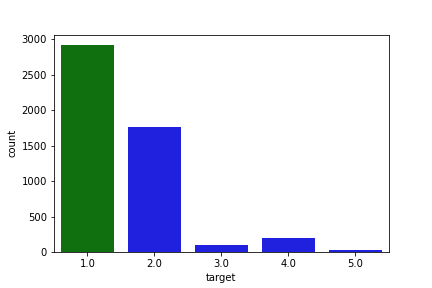
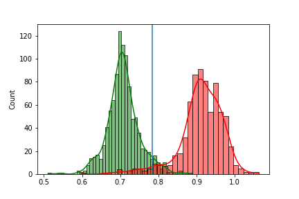
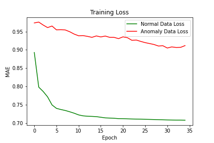

# Anomaly-Detection & Classification of Time-Series Data
## Using FC, LSTM and CNN1D Autoencoder Neural Networks
This is my latest project in which I want to analyze and detect anomalies in univariate time series data with autoencoder neural networks.
## The Data 
The used dataset is the ECG5000, which contains biosignals from humans. The data is a collection from an electrocardiogram.

 

In the left picture you can see the average of the timeseries samples with one standard deviation of the healthy signals in green and the average of the anomaly samples of the signals in blue. In the right plot, you can see the distribution of the dataset - we have a large amount of healthy timeseries sequences (label 1) and a large amount of anomalies (label 2, 3, 4 and 5). The labels 2, 3, 4, 5 are different conditions, but they are all anomaly sequences.

The healthy and normal sequence of the whole dataset is seen in the following plot, averaged over all healthy sequences:

All the sequences, that are classified as the anomalies are presented below, each averaged over all sequences of the same label:

    

## Results - Autoencoder with Fully Connected Layers
The Autoencoder with purely Fully Connected Layers, was trained on the normal Training Data. The reconstruction error threshold, that defines wether we classify a timeseries sequence as normal or anomaly, is chosen from the training loss of every samples of the normal training data and the anormal training data. In The left picture we see a histogram of the losses of all training samples. In green, we see the reconstruction error of normal data and in red we see the loss of anomaly data in a histogram. We can clearly differ the normal from the unnormal samples based on the reconstruction error with our eyes!

 

We choose a threshold ba taking the mean of the reconstruction errors of the normal samples plus a hyperparameter times one standart deviation of the reconstruction loss of normal samples. We evaluate the anomaly detection classifier based on reconstruction error with our test dataset. The confusion matrix of Training and Test Dataset can be seen below:

 

## Results - Autoencoder with LSTM Layers
--NEXT-- (Currently working on)

## Results - Autoencoder with Convolutional-1D Layers
--NEXT--

## Results - Variational Autoencoder
--NEXT--

## Goals
I am going to implement Unsupervised/ Semi Supervised Learning for Anomaly Detection of time series data using an Autoencoder (AE) and Variational Autoencoder (VAE) Neural Networks.
I will test
- Fully Connected (FC)
- Long-Short-Term-Memory (LSTM)
- 1D Convolutional (CNN1D)

Autoencoder Neural Network based on their Test Dataset performance with different metrics like Accuracy, Precision and Recall. They will measure the ability of the networks to classify anomalies as such and to differ them from normal samples. After the anomaly detection is implemented and evaluated, I want to classify the time series sequences with supervised learning - Here, the Autoencoder act as a Feature Extractor and we can train the classifier on top of the Encoder Network.

## What is an Autoencoder?
Autoencoder Neural Networks, in general, crunches the high-dimensional data into  a compressed, low-dimensional representation of the data and then classifies anomalys based on the reconstruction-error of trying to reconstruct the original data from the compressed and low-dimensional data representation. Autoencoders are therefore a more general and nonlinear form of the linear Principal Component Analysis (PCA).

Image Source: https://lilianweng.github.io/lil-log/2018/08/12/from-autoencoder-to-beta-vae.html

The Input data is inputed into the Encoder Neural Network and is crunched into a low dimensional representation. The number of Parameters, that describe this low-dimensional representation is much smaller than the inputed original data. For example the Input is a timeseries sample with 500 timesteps, then the data could be crunched by the Encoder into a vector representation with only 20 entries - This is called the Bottleneck or Bottleneck-Layer or Latent-Representation.
The Decoder takes the low-dimensional representation of the data as input and decrunches the data back into the shape of the original data sample (500). The whole Network therefore does nothing else, as trying to reconstruct its own input! This is why it is trained without labels - only with features: Features in - Features out!

## What is a Variational Autoencoder?

--TO COME--
